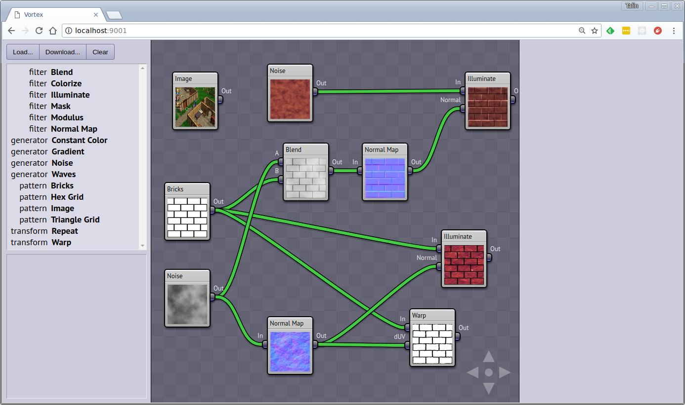

Vortex
======

Vortex is a texture generator application. It's intent is to make it easy to create tileable textures for use in 3D models.

Vortex is heavily inspired by Holger Dammertz's NeoTextureEdit application. There are a number of
significant differences between the two programs, the biggest of which is the fact that Vortex has
been entirely rewritten in JavaScript and runs entirely in the browser.

The actual computation of the images is performed via WebGL.

## Screenshot

## Running

    npm install
    npm start

Then navigate to http://localhost:9001
